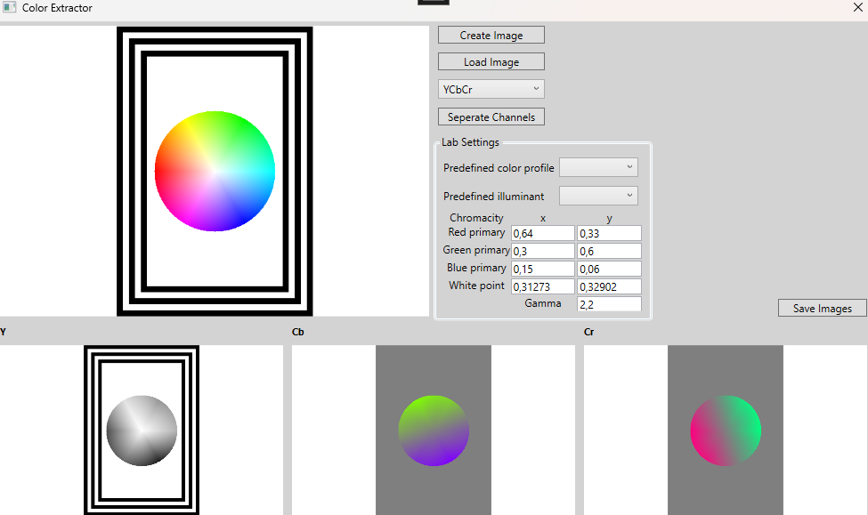
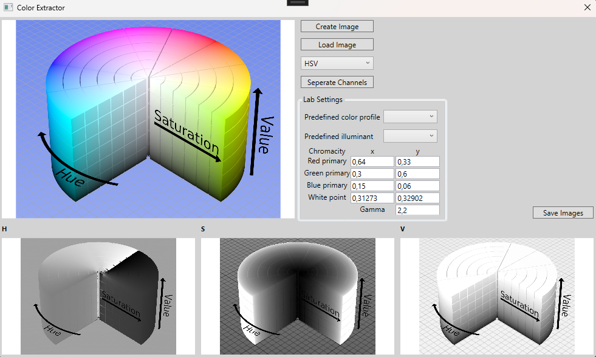
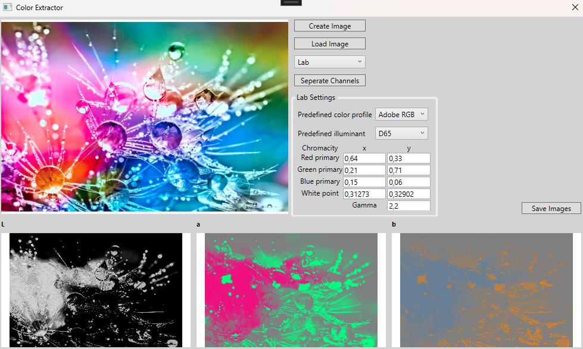

# 🎨 Color Extractor (WPF)

A desktop application written in **C# / WPF** that allows loading, generating, and processing images in multiple color spaces. The program supports color channel extraction and configurable Lab color profiles.

## 🎓 Academic Context

Project created as part of the academic course **Computer Graphics** during the **2024/2025 winter semester** at **Warsaw University of Technology**.

## ✨ Features

* 🖼️ **Image input**

  * Load a custom image from disk.
  * Or use **Create Image** to generate a predefined sample image.

* 🌈 **Color spaces**

  * Convert images into:

    * **YCbCr**
    * **HSV**
    * **CIE Lab**

* ✂️ **Channel separation**

  * Use **Separate Channels** to extract and display the 3 components of the selected color space as independent grayscale images.

* ⚙️ **Lab settings**

  * Choose from predefined **color profiles** (sRGB, Adobe RGB, Apple RGB, CIE RGB, Wide Gamut).
  * Select a predefined **illuminant** (A, B, C, D50, D55, D65, D75, 9300K, E, F2, F7, F11).
  * Customize chromaticity coordinates for **red, green, blue primaries**, **white point**, and **gamma** values.

* 💾 **Export**

  * Save processed images to disk.

## 🎮 Controls

* 📂 **Open Image** – load an image from file.
* 🖼️ **Create Image** – generate a predefined sample image.
* 🎚️ **Separate Channels** – split into Y/Cb/Cr, H/S/V, or L/a/b components.
* 📝 **Lab Settings** – adjust color profile, illuminant, primaries, white point, and gamma.
* 💾 **Save Image** – export the resulting image.

## 🛠️ Technologies

* **C# / WPF**
* Color space conversions (**RGB ↔ YCbCr, HSV, Lab**)
* Customizable **Lab profile handling**

## 🖼️ Preview

## 👤 Author

Developed by [Piotr Iśtok](https://github.com/p10tr13).

## 📜 License

This project is released under the MIT License.
